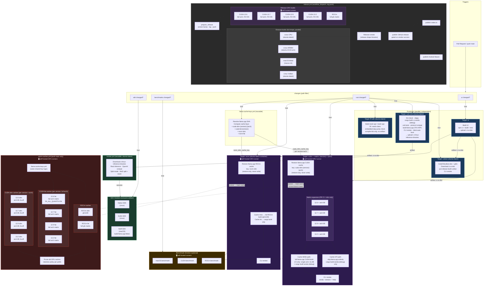

```mermaid
flowchart TD
    subgraph Triggers["Triggers"]
        PR["Pull Request / push main"]
    end
    subgraph Changes["changes (path filter)"]
        F_UI["ui changed?"]
        F_RUST["rust changed?"]
        F_SDK["sdk changed?"]
        F_BENCH["benchmarks changed?"]
    end
    PR --> Changes
    %% ── Cache key resolution (shared by CI + warm-caches) ──
    subgraph CacheKeys["llama-cache-keys.yml (reusable)"]
        LCK["Resolve llama.cpp SHA\nCompute cache keys:\n• cuda-slim-{version}-{arch}\n• cuda-fat-{version}\n• rocm-slim\n• rocm-fat"]
    end
    F_RUST -- "true" --> LCK
    %% ── Producers ──
    subgraph Producers["Producers (parallel, independent)"]
        direction TB
        subgraph UI_Target["Target: ui"]
            UI["Build UI\nnpm ci + build + test\n→ upload: ci-ui-dist"]
        end
        subgraph Core_Target["Target: rust-core (ubuntu-latest)"]
            CORE["fmt check · clippy\ncargo build -p senda (debug)\nunit tests · protocol compat\nbuild llama.cpp CPU+RPC\nCLI smoke · client-auto boot\n→ upload: ci-linux-inference-binaries"]
        end
        subgraph FFI_Target["Target: ffi-sdk (ubuntu-latest)"]
            FFI["Build mesh-api / mesh-api-ffi / mesh-client\nembedded dep purity check\ncompile+lint only, no artifact"]
        end
        subgraph Vulkan_Target["Target: vulkan (ubuntu-latest)"]
            VULKAN["Install libvulkan-dev + glslc\nDownload ci-ui-dist\njust release-build-vulkan\nCLI smoke"]
        end
    end
    F_UI -- "true" --> UI_Target
    F_RUST -- "true" --> Core_Target
    F_RUST -- "true" --> FFI_Target
    F_RUST -- "true" --> Vulkan_Target
    UI_Target -- "artifact: ci-ui-dist" --> Vulkan_Target
    %% ── CUDA matrix (self-hosted GPU runner) ──
    subgraph CUDA_Matrix["Target: cuda  —  matrix: {version} × {arch}\n🖥️ self-hosted GPU runner"]
        direction TB
        CUDA_RESTORE["Restore llama.cpp CUDA cache\nkey: cuda-slim-{version}-{arch}\n(restore-only, never write)"]
        subgraph CUDA_Variants["Matrix expansion (PR CI = slim only)"]
            CUDA_126_89["12.6 × arch 89"]
            CUDA_127_89["12.7 × arch 89"]
            CUDA_129_89["12.9 × arch 89"]
            CUDA_132_89["13.2 × arch 89"]
        end
        CUDA_RESTORE --> CUDA_Variants
        CUDA_BUILD_MISS["Cache MISS path:\nfull llama.cpp CUDA build\n(CI-only: single arch, fa-off)\n+ cargo build senda (debug)"]
        CUDA_BUILD_HIT["Cache HIT path:\nskip llama.cpp entirely\ncargo build senda (debug) only"]
        CUDA_SMOKE["CLI smoke\nsenda --version / --help"]
        CUDA_Variants --> CUDA_BUILD_MISS
        CUDA_Variants --> CUDA_BUILD_HIT
        CUDA_BUILD_MISS --> CUDA_SMOKE
        CUDA_BUILD_HIT --> CUDA_SMOKE
    end
    LCK -- "cuda_slim_cache_key\nper version×arch" --> CUDA_RESTORE
    F_RUST -- "true" --> CUDA_Matrix
    UI_Target -- "artifact: ci-ui-dist" --> CUDA_Matrix
    %% ── ROCm (self-hosted GPU runner) ──
    subgraph ROCm_Target["Target: rocm (ubuntu-latest container)\n🖥️ self-hosted GPU runner"]
        ROCM_RESTORE["Restore llama.cpp ROCm cache\nkey: rocm-slim\n(restore-only, never write)"]
        ROCM_BUILD["Cache miss → full ROCm build (gfx1100)\nCache hit → cargo build only"]
        ROCM_SMOKE["CLI smoke"]
        ROCM_RESTORE --> ROCM_BUILD --> ROCM_SMOKE
    end
    LCK -- "rocm_slim_cache_key" --> ROCM_RESTORE
    F_RUST -- "true" --> ROCm_Target
    UI_Target -- "artifact: ci-ui-dist" --> ROCm_Target
    %% ── Smoke tests (consume artifact) ──
    subgraph Smoke["smoke.yml (reusable, ubuntu-latest)"]
        SMOKE["Download ci-linux-inference-binaries\nReal inference · OpenAI compat\nSplit-mode · MoE split + mesh"]
    end
    CORE -- "artifact" --> SMOKE
    subgraph SDK_Smokes["SDK Smokes (consume artifact)"]
        direction LR
        NATIVE["Native SDK\n(Linux)"]
        KOTLIN["Kotlin SDK\n(Linux)"]
        SWIFT["Swift SDK\n(macOS)\nbuild llama.cpp Metal"]
    end
    SMOKE -- "success" --> SDK_Smokes
    F_SDK -- "true" --> SDK_Smokes
    %% ── Benchmark smokes (optional, self-hosted) ──
    subgraph Bench_Smokes["Benchmark Smokes (optional)\n🖥️ self-hosted runners"]
        direction LR
        SWIFT_BENCH["macOS benchmark"]
        CUDA_BENCH["CUDA benchmark"]
        ROCM_BENCH["ROCm benchmark"]
    end
    F_BENCH -- "true" --> Bench_Smokes
    CUDA_Matrix --> CUDA_BENCH
    ROCm_Target --> ROCM_BENCH
    %% ════════════════════════════════════════════════════
    %% Warm caches (push main only — single writer)
    %% ════════════════════════════════════════════════════
    subgraph WarmCaches["warm-caches.yml (push main only)\n🖥️ self-hosted GPU runners"]
        direction TB
        WC_KEYS["llama-cache-keys.yml\n(same shared key logic)"]
        subgraph WC_CUDA_Slim["CUDA slim caches (per version × arch)"]
            WCS_126["12.6 slim\narch 89, fa-off"]
            WCS_127["12.7 slim\narch 89, fa-off"]
            WCS_129["12.9 slim\narch 89, fa-off"]
            WCS_132["13.2 slim\narch 89, fa-off"]
        end
        subgraph WC_CUDA_Fat["CUDA fat caches (per version, full arch)"]
            WCF_126["12.6 fat\nfull arch matrix\nFA_ALL_QUANTS=ON"]
            WCF_127["12.7 fat\nfull arch matrix"]
            WCF_129["12.9 fat\nfull arch matrix"]
            WCF_132["13.2 fat\nfull arch matrix"]
        end
        subgraph WC_ROCm["ROCm caches"]
            WCR_SLIM["ROCm slim\ngfx1100"]
            WCR_FAT["ROCm fat\nfull gfx matrix"]
        end
        PRUNE["Prune old GPU caches\nretention policy per prefix"]
        WC_KEYS --> WC_CUDA_Slim & WC_CUDA_Fat & WC_ROCm
        WC_CUDA_Slim & WC_CUDA_Fat & WC_ROCm --> PRUNE
    end
    CUDA_RESTORE -. "restore ← main cache\n(cross-branch read)" .-> WC_CUDA_Slim
    ROCM_RESTORE -. "restore ← main cache" .-> WC_ROCm
    %% ════════════════════════════════════════════════════
    %% Release (separate shape, separate trigger)
    %% ════════════════════════════════════════════════════
    subgraph Release["release.yml (workflow_dispatch, tag push)"]
        REL_PREP["prepare_release\nversion bump · tag · push"]
        subgraph REL_Builds["Release builds (full shape, parallel)"]
            REL_CPU["Linux CPU\n(ubuntu-latest)"]
            REL_ARM["Linux ARM64\n(ubuntu-24.04-arm)"]
            REL_MACOS["macOS Metal\n(macos-14)"]
            REL_VULKAN["Linux Vulkan\n(ubuntu-latest)"]
        end
        subgraph REL_GPU["Release GPU builds\n🖥️ self-hosted runners"]
            REL_CUDA_126["CUDA 12.6\nfull arch, FA=ON"]
            REL_CUDA_127["CUDA 12.7\nfull arch, FA=ON"]
            REL_CUDA_129["CUDA 12.9\nfull arch, FA=ON"]
            REL_CUDA_132["CUDA 13.2\nfull arch, FA=ON"]
            REL_ROCM["ROCm\nfull gfx matrix"]
        end
        REL_SMOKE["Release smoke\n(release-shape binaries)"]
        PUBLISH["publish GitHub release\ngated on smoke success"]
        PUB_CRATES["publish crates.io"]
        PUB_ANDROID["publish Android Maven"]
        REL_PREP --> REL_Builds & REL_GPU
        REL_CPU --> REL_SMOKE --> PUBLISH
        PUBLISH --> PUB_CRATES & PUB_ANDROID
    end
    style UI_Target fill:#1a3a5c,stroke:#4a90d9,color:#e8f4fd
    style Core_Target fill:#1a3a5c,stroke:#4a90d9,color:#e8f4fd
    style FFI_Target fill:#1a3a5c,stroke:#4a90d9,color:#e8f4fd
    style Vulkan_Target fill:#1a3a5c,stroke:#4a90d9,color:#e8f4fd
    style CUDA_Matrix fill:#2d1b4e,stroke:#9b59b6,color:#f5eeff
    style CUDA_Variants fill:#3d2b5e,stroke:#9b59b6,color:#f5eeff
    style ROCm_Target fill:#2d1b4e,stroke:#9b59b6,color:#f5eeff
    style Smoke fill:#1a3d2e,stroke:#2ecc71,color:#eaffef
    style SDK_Smokes fill:#1a3d2e,stroke:#2ecc71,color:#eaffef
    style Bench_Smokes fill:#3d2b00,stroke:#f39c12,color:#fff8e1
    style WarmCaches fill:#3d1a1a,stroke:#e74c3c,color:#ffebeb
    style WC_CUDA_Slim fill:#4d2a2a,stroke:#e74c3c,color:#ffebeb
    style WC_CUDA_Fat fill:#4d2a2a,stroke:#e74c3c,color:#ffebeb
    style WC_ROCm fill:#4d2a2a,stroke:#e74c3c,color:#ffebeb
    style Release fill:#2a2a2a,stroke:#888,color:#ddd
    style REL_Builds fill:#3a3a3a,stroke:#888,color:#ddd
    style REL_GPU fill:#3a2a4a,stroke:#9b59b6,color:#f5eeff
```
